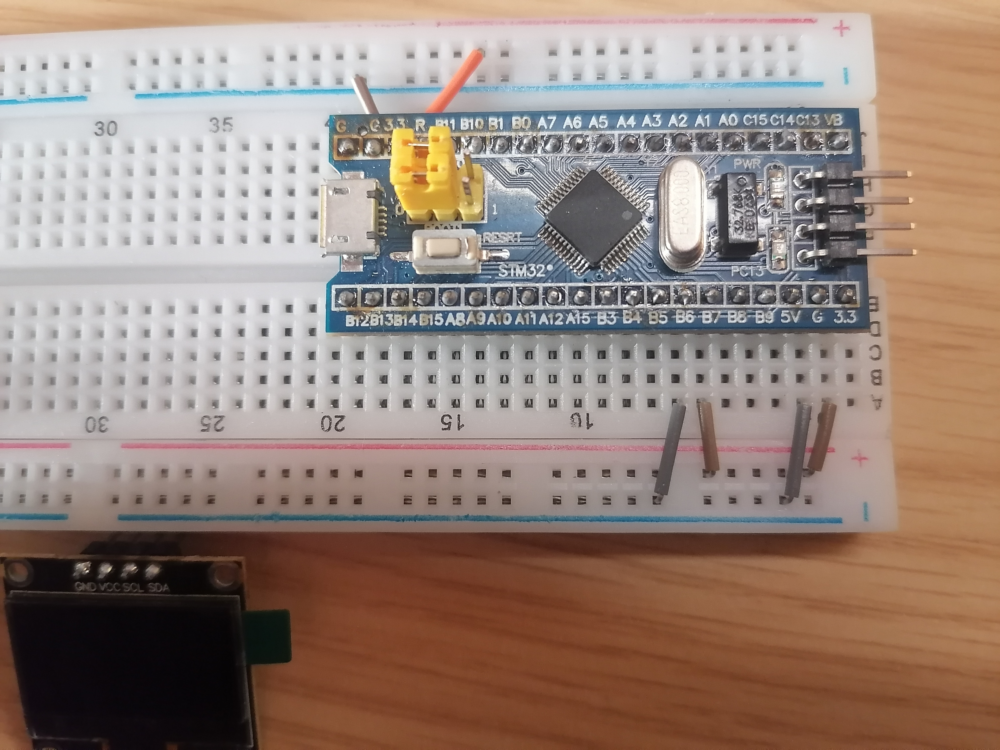
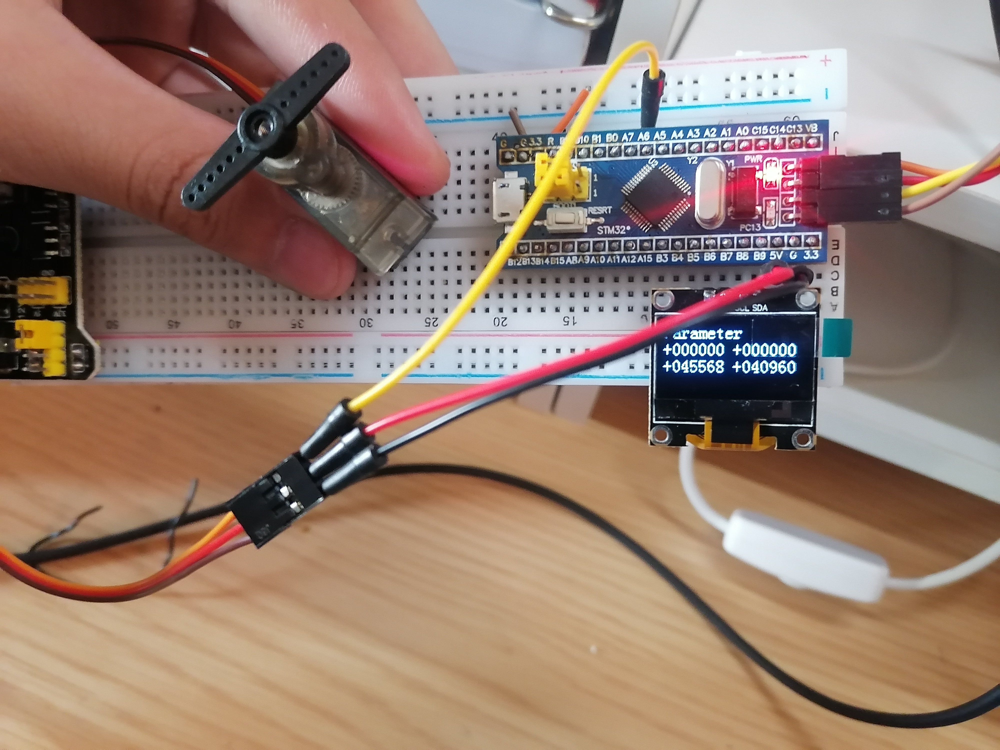
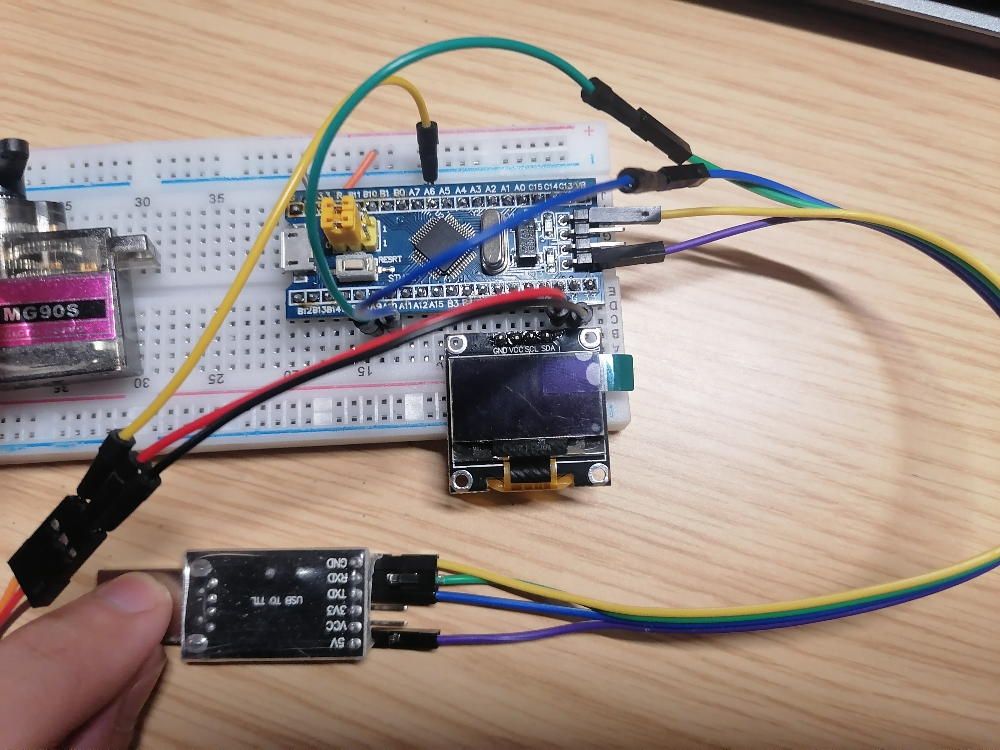
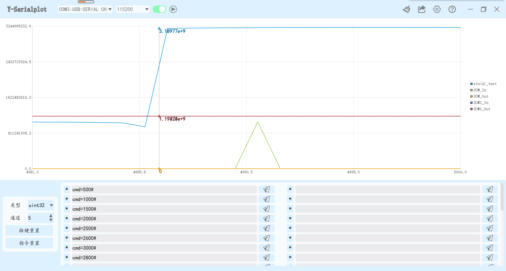
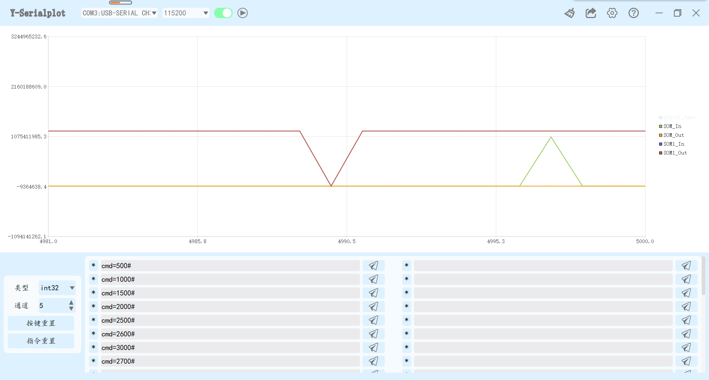
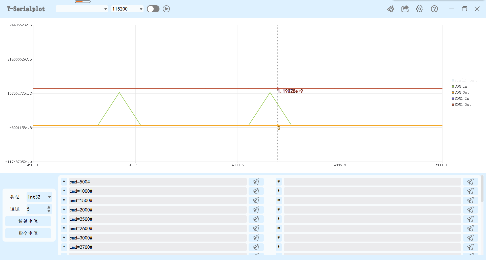

# NUAA自由探索

---

* 人员，小蒋，小马，张，苏。新手入坑单片机，别喷，喷就是你对

* 有疑问联系：
  * 小马，QQ或WeChat：3071910019，欢迎一起探讨交流。
  * 小蒋，哎嘿嘿，漂亮姐姐，嘿嘿，……。咳咳，得正经一点，……嗯……，她的联系方式，我就不给了。

## 简介

    开发板STM32F103C8
    软件MDK-ARM，keil5
    基于标准库的开发

* ## 波形显示及上位机控制软件地址：<https://github.com/syuan7/y-serialplot>

---

# 代码简介

## PWM初始化

    //定时器3
    //PA6，PA7 TIM3CH1|2
    //函数变量中的参数，调节pwm波的周期（main函数参数调节）
    void TIM3_Init(u16 arr, u16 psc)
    {

        GPIO_InitTypeDef  GPIO_InitStructure;    //GPIO
        TIM_TimeBaseInitTypeDef TIM_TimeBaseInitStruct;  //定时器
        TIM_OCInitTypeDef TIM_OCInitStruct;     //通道

        
        //开启时钟总线 
        RCC_APB2PeriphClockCmd(RCC_APB2Periph_GPIOA, ENABLE);  
        RCC_APB1PeriphClockCmd(RCC_APB1Periph_TIM3, ENABLE);
        RCC_APB2PeriphClockCmd(RCC_APB2Periph_AFIO, ENABLE);
        
            
        GPIO_InitStructure.GPIO_Pin = GPIO_Pin_6|GPIO_Pin_7;  //PWM0-7 端口配置
        GPIO_InitStructure.GPIO_Mode = GPIO_Mode_AF_PP;    //复用推挽
        GPIO_InitStructure.GPIO_Speed = GPIO_Speed_50MHz;   //IO口速度为50MHz
        GPIO_Init(GPIOA, &GPIO_InitStructure);      //根据设定参数初始化GPIOA0-7
        GPIO_ResetBits(GPIOC,GPIO_Pin_13);       //PA0-7输出为低
        
        
        TIM_TimeBaseInitStruct.TIM_ClockDivision=TIM_CKD_DIV1;//分频因子
        TIM_TimeBaseInitStruct.TIM_CounterMode=TIM_CounterMode_Up;//向上计数
        TIM_TimeBaseInitStruct.TIM_Period=arr;//自动重装载值
        TIM_TimeBaseInitStruct.TIM_Prescaler=psc;//预分频系数
        TIM_TimeBaseInit(TIM3,&TIM_TimeBaseInitStruct);
        
        
        TIM_OCInitStruct.TIM_OCMode=TIM_OCMode_PWM1;
        TIM_OCInitStruct.TIM_OCNPolarity=TIM_OCNPolarity_High;
        TIM_OCInitStruct.TIM_OutputState=TIM_OutputState_Enable;
        TIM_OC1Init(TIM3,&TIM_OCInitStruct);//通道1
        TIM_OC2Init(TIM3,&TIM_OCInitStruct);//通道2
        
        TIM_OC1PreloadConfig(TIM3,TIM_OCPreload_Enable);
        TIM_OC2PreloadConfig(TIM3,TIM_OCPreload_Enable);//使能预装载器
        TIM_Cmd(TIM3,ENABLE);//使能TIM3
        
        
        TIM_SetCompare2(TIM3,1500);
        TIM_SetCompare3(TIM3,2000);

    }

## 舵机的转动角度

    int main(void)
    {
        ……
        //  300能转的最小值
        //  0.5ms-0
        //  1.0ms-45
        //  1.5ms-90
        //  2.0ms-135
        //  2.5-180
        //  2600还能转最后一下
        //  2700为一个特殊参数，可一直旋转
        while(1)
        {
            //占空比=x/20000
            TIM_SetCompare1(TIM3,command);  //500/20000==0.5/20
            delay_ms(1000);
            ……
        }
    }

## 参数command可通过上位机软件传入

* ## 修改软件通信协议

* USER\main.c

            void get_cmd(void)
        {
            char u_buff[10];
            int u_d1;//,u_d2,u_d3;
            //在usart_get_data()函数定义中可更改通信协议，（改变发送命令格式）
            if(usart_get_data(u_buff,&u_d1))//(usart_get_data(u_buff,&u_d1,&u_d2,&u_d3))
            {
                if(strcmp(u_buff,"cmd") == 0) //比较命令控制字符是否为指令字符
                {
                    command=u_d1;
        //   cmd_P = u_d1;
        //   cmd_I = u_d2;
        //   cmd_D = u_d3;
        //   pid_p = (float)((USART_RX_BUF[1]-'0')*10000+(USART_RX_BUF[2]-'0')*1000+(USART_RX_BUF[3]-'0')*100+(USART_RX_BUF[4]-'0')*10+(USART_RX_BUF[5]-'0'))/10000;
        //   USART_RX_STA=0;
                }
            }

            
            memset(u_buff,0,sizeof(u_buff));
        }

* SYSTEM\usart\usart.c

        //通信协议更改
        u8 usart_get_data(char *cmd,int *d1)//,float *d2,float *d3)
        {
            u8 flag = 0;
            if(usart_readok == 1)
            {
                if(sscanf(usart_readbuff,"%3s=%d#",cmd,d1)==2)//cmd,d1,d2,d3)==4)
                {
                    flag = 1;
                }
                //清除接收完成标志
                memset(usart_readbuff,0,sizeof(usart_readbuff));
                usart_readok = 0;
            }
            return flag;
        }

* 格式：cmd=参数#，传入command

        输入参数格式：时间*1000加#
        如，0.5对0°，输入:cmd=500#

        时间——角度
        //  0.3ms能转的最小值
        //  0.5ms-0
        //  1.0ms-45
        //  1.5ms-90
        //  2.0ms-135
        //  2.5ms-180
        //  2.6还能转最后一下
        //  2.7为一个特殊参数，可一直旋转

---

# 接线介绍

* # 基本连接

* 如图所示

        OLED显示屏GND接B6，SDA接B9

* 

        定时器3的通道1和2，舵机信号线可接PA6或PA7，电源线接5v

        ST-Link连接到上开发板（如下图所示），用keil编译程序通过后，将程序下载到开发板上，

* 下载程序时的连接

        command初始值为500（0°），下载完成后，按下reset键，舵机旋转至初始位置，

        如需使用keil的逻辑分析仪（Logic Analyzer），请自行修改相关配置，否则，没有读写权限

* # 换接CH340，接线方式

        电源（5v，3v，vcc逻辑电源：个别设备可能有差别，接3v无法驱动舵机，改接5v或逻辑电源即可）端连接至stm32右端电源，GND对GND，

        CH340发送端（TX）接PA10，接收端（RX）接PA9，后打开上位机软件y-serialplot，并切换波特率至115200，数据类型int32或uint32都可，通道5个。通道一sin_test是sin函数，测试能否正常显示波形，

        SOM_In/Out为函数GPIO_ReadInputDataBit(GPIO_TypeDef*GPIOx, uint16_t GPIO_Pin)/GPIO_ReadOutputDataBit(GPIO_TypeDef* GPIOx, uint16_t GPIO_Pin)返回值，The input/output port pin value（输入/输出端口引脚值），在OLED第二行显示。

        SOM1_In/Out为函数GPIO_ReadInputData(GPIO_TypeDef*GPIOx)/GPIO_ReadOutputData(GPIO_TypeDef* GPIOx)返回值，GPIO input/output data port value（GPIO输入/输出数据端口值），在OLED第三行显示。

* 如图所示

* 

* 

* 

* 

---

* # End of all introductions ,peace~
